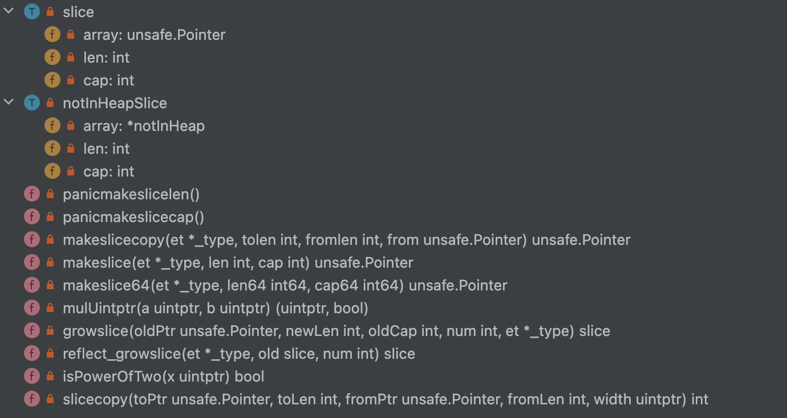
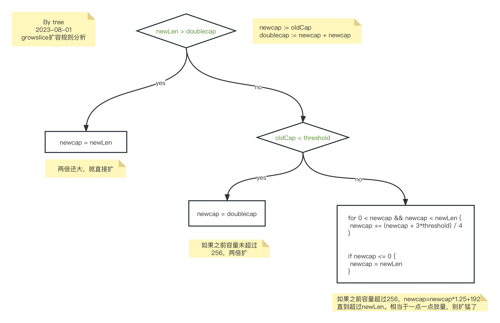
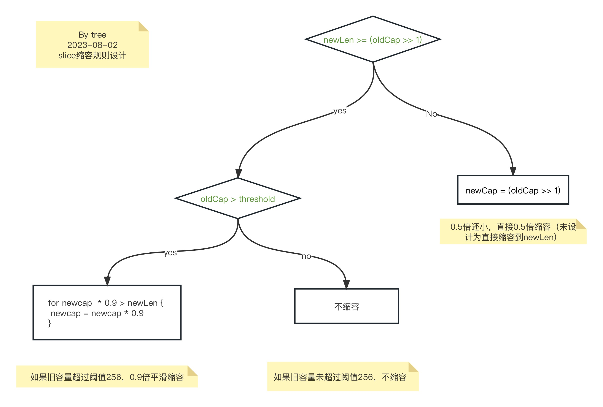

# 实现内容

实现切片的删除操作。

实现删除切片特定下标元素的方法。

+ 要求一：能够实现删除操作就可以。
+ 要求二：考虑使用比较高性能的实现。
+ 要求三：改造为泛型方法。
+ 要求四：支持缩容，并且设计缩容机制

# 性能测试

测试命令

```shell
go test -bench=.
```

测试数据量要大，才能测出效果。

实现一

```shell
goos: darwin
goarch: arm64
pkg: github.com/rui-cs/go-learning/slice_del/implementation01
BenchmarkDelElem-10        12030             98751 ns/op
PASS
ok      github.com/rui-cs/go-learning/slice_del/implementation01        2.780s
```

实现二

```shell
goos: darwin
goarch: arm64
pkg: github.com/rui-cs/go-learning/slice_del/implementation02
BenchmarkDelElem-10        24105             45701 ns/op
PASS
ok      github.com/rui-cs/go-learning/slice_del/implementation02        1.983s
```

从测试结果看，实现二的性能更高

# slice设计学习

slice 实现源码 runtime/slice.go (版本1.20rc2)



slice 存储结构

```go
type slice struct {
	array unsafe.Pointer // 指向底层数组
	len   int
	cap   int
}
```

growslice

```go
// growslice allocates new backing store for a slice.
//
// arguments:
//
//	oldPtr = pointer to the slice's backing array
//	newLen = new length (= oldLen + num)
//	oldCap = original slice's capacity.
//	   num = number of elements being added
//	    et = element type
//
// return values:
//
//	newPtr = pointer to the new backing store
//	newLen = same value as the argument
//	newCap = capacity of the new backing store
//
// Requires that uint(newLen) > uint(oldCap).
// Assumes the original slice length is newLen - num
//
// A new backing store is allocated with space for at least newLen elements.
// Existing entries [0, oldLen) are copied over to the new backing store.
// Added entries [oldLen, newLen) are not initialized by growslice
// (although for pointer-containing element types, they are zeroed). They
// must be initialized by the caller.
// Trailing entries [newLen, newCap) are zeroed.
//
// growslice's odd calling convention makes the generated code that calls
// this function simpler. In particular, it accepts and returns the
// new length so that the old length is not live (does not need to be
// spilled/restored) and the new length is returned (also does not need
// to be spilled/restored).
func growslice(oldPtr unsafe.Pointer, newLen, oldCap, num int, et *_type) slice {
	oldLen := newLen - num
	if raceenabled {
		callerpc := getcallerpc()
		racereadrangepc(oldPtr, uintptr(oldLen*int(et.size)), callerpc, abi.FuncPCABIInternal(growslice))
	}
	if msanenabled {
		msanread(oldPtr, uintptr(oldLen*int(et.size)))
	}
	if asanenabled {
		asanread(oldPtr, uintptr(oldLen*int(et.size)))
	}

	if newLen < 0 {
		panic(errorString("growslice: len out of range"))
	}

	if et.size == 0 {
		// append should not create a slice with nil pointer but non-zero len.
		// We assume that append doesn't need to preserve oldPtr in this case.
		return slice{unsafe.Pointer(&zerobase), newLen, newLen}
	}

	newcap := oldCap
	doublecap := newcap + newcap
	if newLen > doublecap {
		newcap = newLen
	} else {
		const threshold = 256
		if oldCap < threshold {
			newcap = doublecap
		} else {
			// Check 0 < newcap to detect overflow
			// and prevent an infinite loop.
			for 0 < newcap && newcap < newLen {
				// Transition from growing 2x for small slices
				// to growing 1.25x for large slices. This formula
				// gives a smooth-ish transition between the two.
				newcap += (newcap + 3*threshold) / 4
			}
			// Set newcap to the requested cap when
			// the newcap calculation overflowed.
			if newcap <= 0 {
				newcap = newLen
			}
		}
	}

	var overflow bool
	var lenmem, newlenmem, capmem uintptr
	// Specialize for common values of et.size.
	// For 1 we don't need any division/multiplication.
	// For goarch.PtrSize, compiler will optimize division/multiplication into a shift by a constant.
	// For powers of 2, use a variable shift.
	switch {
	case et.size == 1:
		lenmem = uintptr(oldLen)
		newlenmem = uintptr(newLen)
		capmem = roundupsize(uintptr(newcap))
		overflow = uintptr(newcap) > maxAlloc
		newcap = int(capmem)
	case et.size == goarch.PtrSize:
		lenmem = uintptr(oldLen) * goarch.PtrSize
		newlenmem = uintptr(newLen) * goarch.PtrSize
		capmem = roundupsize(uintptr(newcap) * goarch.PtrSize)
		overflow = uintptr(newcap) > maxAlloc/goarch.PtrSize
		newcap = int(capmem / goarch.PtrSize)
	case isPowerOfTwo(et.size):
		var shift uintptr
		if goarch.PtrSize == 8 {
			// Mask shift for better code generation.
			shift = uintptr(sys.TrailingZeros64(uint64(et.size))) & 63
		} else {
			shift = uintptr(sys.TrailingZeros32(uint32(et.size))) & 31
		}
		lenmem = uintptr(oldLen) << shift
		newlenmem = uintptr(newLen) << shift
		capmem = roundupsize(uintptr(newcap) << shift)
		overflow = uintptr(newcap) > (maxAlloc >> shift)
		newcap = int(capmem >> shift)
		capmem = uintptr(newcap) << shift
	default:
		lenmem = uintptr(oldLen) * et.size
		newlenmem = uintptr(newLen) * et.size
		capmem, overflow = math.MulUintptr(et.size, uintptr(newcap))
		capmem = roundupsize(capmem)
		newcap = int(capmem / et.size)
		capmem = uintptr(newcap) * et.size
	}

	// The check of overflow in addition to capmem > maxAlloc is needed
	// to prevent an overflow which can be used to trigger a segfault
	// on 32bit architectures with this example program:
	//
	// type T [1<<27 + 1]int64
	//
	// var d T
	// var s []T
	//
	// func main() {
	//   s = append(s, d, d, d, d)
	//   print(len(s), "\n")
	// }
	if overflow || capmem > maxAlloc {
		panic(errorString("growslice: len out of range"))
	}

	var p unsafe.Pointer
	if et.ptrdata == 0 {
		p = mallocgc(capmem, nil, false)
		// The append() that calls growslice is going to overwrite from oldLen to newLen.
		// Only clear the part that will not be overwritten.
		// The reflect_growslice() that calls growslice will manually clear
		// the region not cleared here.
		memclrNoHeapPointers(add(p, newlenmem), capmem-newlenmem)
	} else {
		// Note: can't use rawmem (which avoids zeroing of memory), because then GC can scan uninitialized memory.
		p = mallocgc(capmem, et, true)
		if lenmem > 0 && writeBarrier.enabled {
			// Only shade the pointers in oldPtr since we know the destination slice p
			// only contains nil pointers because it has been cleared during alloc.
			bulkBarrierPreWriteSrcOnly(uintptr(p), uintptr(oldPtr), lenmem-et.size+et.ptrdata)
		}
	}
	memmove(p, oldPtr, lenmem)

	return slice{p, newLen, newcap}
}

```



# 设计缩容规则

由oldCap和newLen的到newCap


